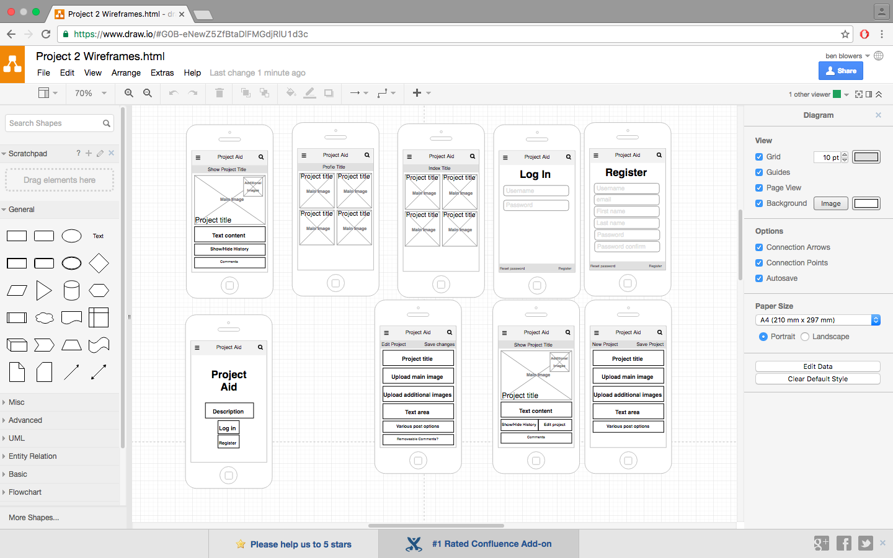
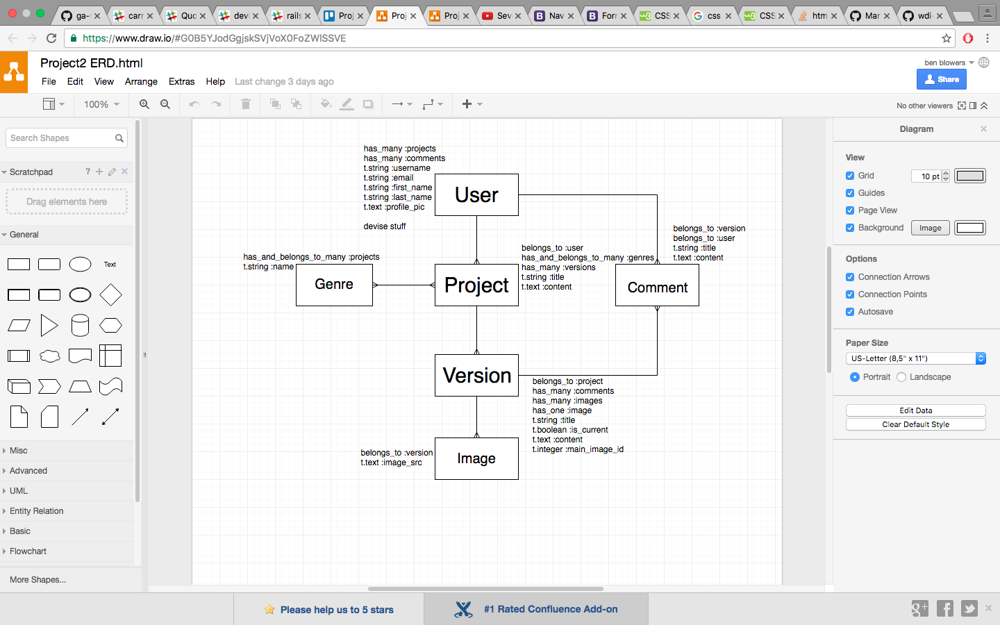

#Introduction

Project-Aid is a site for people to share projects whether they be finished or not.

Users can create, edit, delete projects which can contrain versions of the project. The versions have connected images and comments.

#Planning
I used draw.io for both my wireframes and my ERD.

##Wireframes

##ERD

